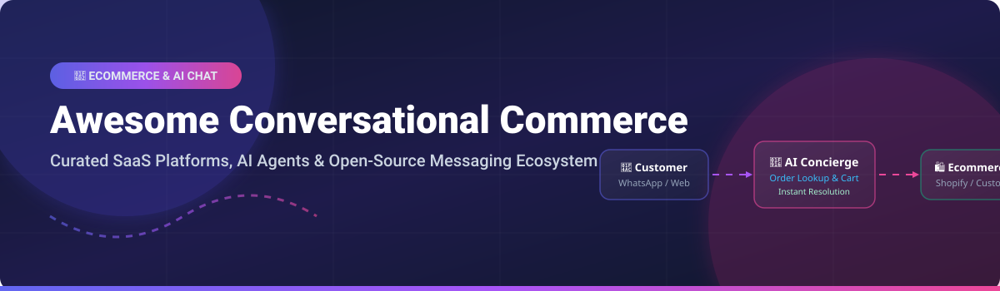

  

# 🛒 Awesome Conversational Commerce

## 🚀 Top Conversational Commerce Platforms & Open-Source Ecosystem

> **Curated List of SaaS Products & Open-Source GitHub Projects for AI Chat, Live Chat, Ecommerce Messaging, Shopping Assistants, Helpdesks & Revenue-Driven Conversations.**

---

### 📊 Conversational Commerce Market Overview

- **Global Market Size**: The global Conversational Commerce market is estimated at **$13.9 Billion** (2026) and projected to reach **$32.6 Billion by 2030**, growing at a CAGR of ~22.4%.
- **Market Structure**: The sector is **moderately fragmented**, featuring high competition between established enterprise messaging suites (Intercom, LivePerson, Salesloft/Drift) and specialized ecommerce AI helpdesks (Gorgias, Tidio, Rep AI), alongside a rapidly expanding self-hosted open-source ecosystem (Langflow, Rocket.Chat, Mattermost, Chatwoot, Rasa, Botpress).

---

## 📌 Table of Contents

- [🏢 SaaS/Hosted Platforms](#-saashosted-platforms)
- [⚡ Open-Source GitHub Projects](#-open-source-github-projects)
- [🤝 How to Contribute](#-how-to-contribute)
- [💖 Support & Sponsorship](#-support--sponsorship)
- [📈 Star History](#-star-history)
- [⚠️ Disclaimer](#%EF%B8%8F-disclaimer)

---

## 🏢 SaaS/Hosted Platforms

*Commercial AI agents, live chat, and messaging platforms rated by market scale (revenue/valuation), pricing tiers, and free plan limitations.*

| Platform | Revenue / Valuation (Scale) 📏 | Starting Pricing Tier 💳 | Free Tier / Trial Limit ⏳ | Key Focus & Features 🎯 |
| :--- | :--- | :--- | :--- | :--- |
| **[Salesloft / Drift](https://www.salesloft.com/)** | **~$231M ARR** ($1.1B Valuation) | Starts at ~$125/user/mo (Enterprise custom quotes) | **No Free Tier** (Request-based demo / 7-day custom trial) | Enterprise revenue orchestration, B2B conversational marketing, and meeting automation. |
| **[Intercom Fin](https://www.intercom.com/)** | **~$200M+ ARR** (Acquired by Salesforce ecosystem) | Starts at **$29/seat/month** + $0.99 per Fin AI resolution | **14-day free trial** (Full access, no credit card required) | AI-first messaging platform, multi-channel customer support, and autonomous resolution. |
| **[LivePerson](https://www.liveperson.com/)** | **~$150M ARR** (Acquired by SoundHound AI) | Custom enterprise pricing (Typically $10,000+/year) | **No Free Tier** (Personalized enterprise demo only) | Enterprise-grade conversational AI, omnichannel messaging, and voice integration. |
| **[ManyChat](https://manychat.com/)** | **~$73M ARR** ($159M Funding raised) | Starts at **$15/month** (Scales by active contacts) | **Free Forever** (Limited to 1,000 active contacts & basic channels) | Automated chat marketing & DM automation for Instagram, WhatsApp, and Facebook. |
| **[Gorgias](https://www.gorgias.com/)** | **~$69M ARR** ($530M+ Valuation) | Starts at **$10/month** (Starter plan, 50 tickets/mo) | **7-day free trial** (Includes 10 trial ticket responses) | Ecommerce-native helpdesk with deep Shopify integration and order management AI. |
| **[Tidio](https://www.tidio.com/)** | **~$10M ARR** ($26.8M Funding raised) | Starts at **$29/month** (Starter plan) | **Free Forever** (Up to 50 chat conversations/month & 100 email tickets) | SMB-friendly live chat, visual chatbot workflow builder, and Lyro AI agent. |
| **[Quiq](https://quiq.com/)** | **~$17M ARR** ($47.5M Funding raised) | Usage-based pricing (Per active conversation quote) | **No Free Tier** (Guided sandbox demo available upon request) | Enterprise conversational customer service & rich messaging across SMS and web. |
| **[Rep AI](https://www.rep.ai/)** | **~$3.5M ARR** (Seed/Series A stage) | Starts at **$99/month** (Based on monthly traffic sessions) | **14-day free trial** (Full AI sales concierge testing) | AI shopping concierge focused on product recommendations and cart conversion. |

---

## ⚡ Open-Source GitHub Projects

*Self-hosted frameworks, omni-channel support desks, visual AI agent builders, and messaging cores ranked by GitHub Stars_Count.*

| Project | GitHub_Stars ⭐ | Repository Link 🔗 | Description & Conversational Commerce Utility 🛠️ |
| :--- | :--- | :--- | :--- |
| **Langflow** |  | **[langflow-ai/langflow](https://github.com/langflow-ai/langflow)** | Open-source AI workflow builder for multi-agent autonomous commerce bots & RAG pipelines. |
| **Flowise** |  | **[FlowiseAI/Flowise](https://github.com/FlowiseAI/Flowise)** | Drag & drop UI node tool for building LLM conversational agents and custom ecommerce integrations. |
| **Rocket.Chat** |  | **[RocketChat/Rocket.Chat](https://github.com/RocketChat/Rocket.Chat)** | Omnichannel communication platform with live chat widgets, WhatsApp connectors, and enterprise security. |
| **Mattermost** |  | **[mattermost/mattermost-server](https://github.com/mattermost/mattermost-server)** | Open-source secure messaging core adaptable for internal customer operations and automated chat. |
| **Chatwoot** |  | **[chatwoot/chatwoot](https://github.com/chatwoot/chatwoot)** | Self-hosted customer support platform & live-chat suite—open alternative to Intercom and Gorgias. |
| **Rasa** |  | **[RasaHQ/rasa](https://github.com/RasaHQ/rasa)** | Enterprise machine learning framework for building contextual, transactional chatbots and voice assistants. |
| **Botpress** |  | **[botpress/botpress](https://github.com/botpress/botpress)** | Developer platform for creating, deploying, and managing generative AI shopping chatbots. |
| **Typebot** |  | **[typebot/typebot](https://github.com/typebot/typebot)** | Conversational form builder embeddable into web apps for lead qualification, checkout, and survey flows. |

---

## 🛠️ Self-Hosted Architecture & Open Stack Patterns

For ecommerce brands seeking 100% data privacy, zero conversation billing fees, and deep custom API control:
- **Human Inbox & Live Desk**: Deploy **Chatwoot** or **Rocket.Chat** for agent takeover and live customer conversations.
- **AI Agent & Dialogue Brain**: Use **Langflow** or **Rasa** connected to LLM endpoints to handle order lookup, return handling, and product recommendations.
- **Store Connectivity**: Connect bot webhooks directly to Shopify Admin API, WooCommerce REST API, or custom backend services.

---

## 🤝 How to Contribute

Contributions are highly welcome! Please read the guidelines below:

1. **Fork** this repository.
2. Add your product or open-source project to `README.md` keeping alphabetical/category table formatting.
3. Ensure accurate pricing info, free tier specs, revenue/Stars_Counts, and direct links.
4. Submit a **Pull Request** with a clear explanation of additions.

Refer to the curated collection of awesome lists at [Awesome-Awesome-Awesome](https://github.com/ishandutta2007/Awesome-Awesome-Awesome).

---

## 💖 Support & Sponsorship

Thank you for exploring and using **Awesome Conversational Commerce**! 🌟

If this repository has helped your ecommerce store, startup, or research:
- ⭐ **Star** this repository on GitHub to show your support!
- 🔀 **Fork** and share it with your fellow developers andCX teams.
- ☕ **Sponsor / Buy me a Coffee**: If you'd like to support open-source maintenance and list curation, please consider sponsoring on the [GitHub Sponsor Dashboard](https://github.com/sponsors/ishandutta2007).

---

## 📈 Star History

---

## ⚠️ Disclaimer

- This list is **community-curated** for research and educational purposes.
- Product logos, trademarks, and company metrics belong to their respective owners.
- Conversational AI systems handling user data and payments must comply with regional privacy regulations (GDPR, CCPA) and channel policies (WhatsApp Commerce Policy).

---

  <b>Made with ❤️ for Ecommerce Operators, CX Leaders & Open-Source AI Builders.</b>

